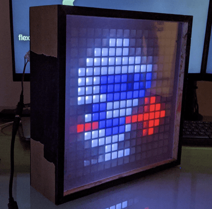

# PixelFrame

pixelframe - a box w/ a DIY 16x16 LED matrix, that displays low res images, gif. Based on a ESP8266 SoC.

## Features
* Pong Clock
* Play Gifs based on API events / MQTT messages (in development)
* Web based management interface (in development)

## Components

### ESP8266 Firmware

The firmware code is found in the base directory. A vscode development container can be used for easier development.

### Webfrontend

The code of the web frontend can be found in the `webfrontend` folder. A vscode development container can be used for easier development.

## How to build

soon to come

## Used sources

https://github.com/Jerware/GameFrameV2
https://github.com/pixelmatix/AnimatedGIFs
https://github.com/marcmerlin/AnimatedGIFs

## Useful links

https://tchapi.github.io/Adafruit-GFX-Font-Customiser/
